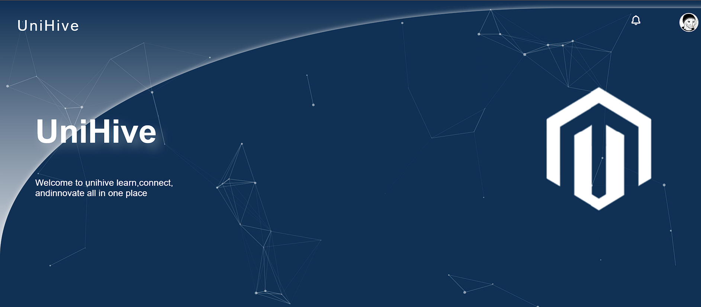
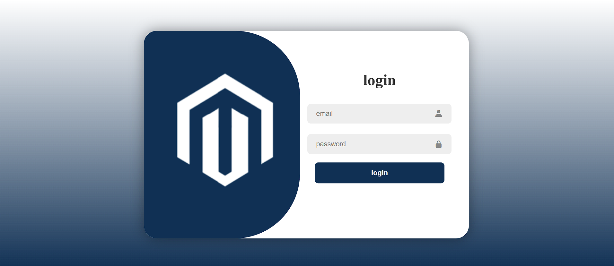
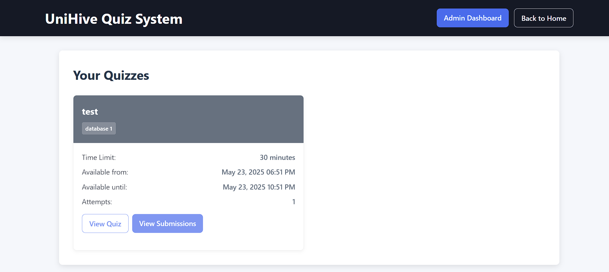
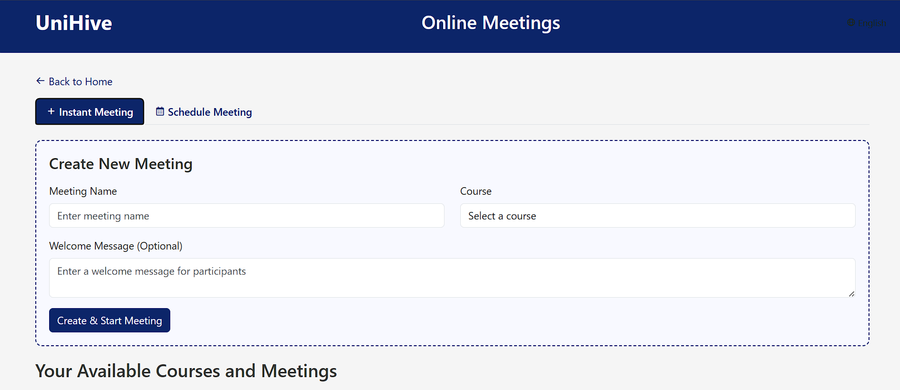

# 🎓 Smart College Management & E-Learning Platform

A full-stack web application designed to simplify academic management and online learning for colleges and educational institutions.

The platform provides course management, virtual classrooms, online examinations, digital resources, attendance tracking, and student services within one integrated system.

---

## 📖 Overview

Smart College Management is a graduation project that digitizes the educational process by providing a complete management platform for students, instructors, and administrators.

The system combines academic management with e-learning features, allowing institutions to manage courses, conduct live lectures, organize exams, and provide educational resources through a modern web interface.

---

## ✨ Features

| Module | Description |
|---------|-------------|
| 🔐 Authentication | Secure Login System |
| 👨‍🏫 User Roles | Admin, Instructor & Student |
| 📚 Course Management | Create and Manage Courses |
| 🎥 Virtual Classroom | BigBlueButton Integration |
| 📝 Online Exams | Exams & Automatic Grading |
| 📅 Attendance | Student Attendance Tracking |
| 📖 Digital Library | Educational Resources |
| 🔔 Notifications | Announcements & Alerts |
| 👤 Student Profile | Personal Dashboard |

---

# 📸 Screenshots

## 🏠 Home Page



---

## 🔐 Login



---

## 👨‍💼 Admin Dashboard


---

## 👨‍🏫 Teacher Dashboard


---

## 📚 Digital Library


---

## 📝 Online Exams



---

## 🎥 Virtual Classroom



---

## 🎥 Meeting Recording


---

## 🏗 System Architecture

```
                 Users

      ┌─────────┼─────────┐
      │         │         │

   Admin   Instructor   Student

      │         │         │
      └─────────┼─────────┘
                │

      Smart College Platform

     Authentication
     Course Management
     Virtual Classroom
     Online Exams
     Digital Library
     Attendance
     Notifications

                │

          MySQL Database

                │

       BigBlueButton Server
```

---

## 🎥 Virtual Classroom

The platform integrates with **BigBlueButton (BBB)** to provide live online classes.

### Features

- Live Video Meetings
- Screen Sharing
- Interactive Whiteboard
- Lecture Recording
- REST API Integration
- SHA1 Checksum Authentication
- Self-hosted BigBlueButton Server

> **Note:** The platform communicates with BigBlueButton through its REST API.

---

## ⚙ Technologies

- PHP
- MySQL
- HTML5
- CSS3
- JavaScript
- Bootstrap
- BigBlueButton REST API
- Git
- GitHub

---

## 🚀 Installation

```bash
git clone https://github.com/tamerayman/Smart-College-Management-E-Learning-Platform.git
```

Configure:

- Database
- Apache/XAMPP
- BigBlueButton API Credentials

Import the SQL database and run the project.

---

## 📂 Project Structure

```
app/

controllers/

models/

views/

config/

assets/

uploads/

database/

screenshots/
```

---

## 📈 Project Status

| Module | Status |
|---------|---------|
| Authentication | ✅ Completed |
| Course Management | ✅ Completed |
| Virtual Classroom | ✅ Completed |
| Online Exams | ✅ Completed |
| Attendance | ✅ Completed |
| Digital Library | ✅ Completed |
| Student Management | ✅ Completed |

---

## 📄 License

This project is licensed under the MIT License.

---

# 👨‍💻 Developed by

**Tamer Ayman**
